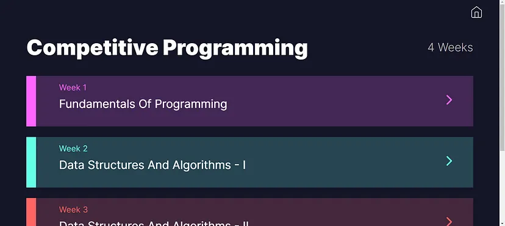
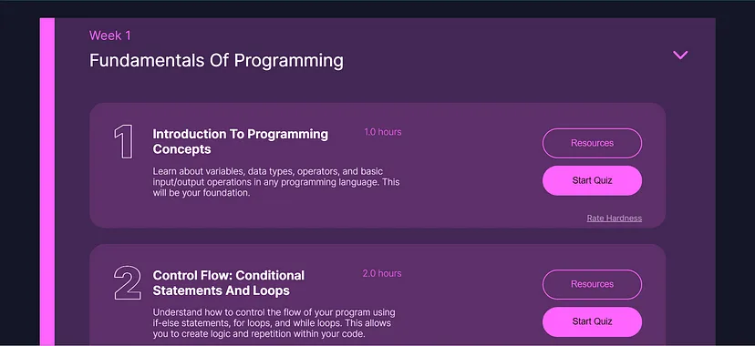

# 🧑‍💻 Effortless Learning Made Simple with AI-Curated Personalized Paths


Picture a platform that designs a customized roadmap for any subject you wish to master—complete with resources—tailored to your unique needs, time availability, preferred language, and existing knowledge. That’s precisely what our AI-powered web-based learning platform offers.

## Installation

```bash
npm install
cd backend
.\humanaize\Scripts\activate #or for linux humanaize/bin/activate
pip install -r requirements.txt
cd ..
```

## Usage 
create `.env` file in `./backend/` directory with the following contents (get your api key from [here](https://ai.google.dev/aistudio) )
```bash
GEMINI_API_KEY=YOUR_GEMINI_API_KEY
```
then to start backend
```bash
npm run backend
```
and to start frontend
```bash
npm start
```



## Demo Video
[https://www.youtube.com/watch?v=v-dP18RBArc](https://www.youtube.com/watch?v=v-dP18RBArc)
[](http://www.youtube.com/watch?v=v-dP18RBArc "LearnX : AI based Personalized Learning | Humanaize Hackathon EdTech Edition. Demo Video")

## What Will This Platform Actually Do?
We are building a web-based platform that generates personalized learning roadmaps with curated resources to help users learn any new skill or subject. It will also track and visualize progress to keep learners motivated.

Users simply enter the topic they want to learn, along with their available time, preferred language, and current knowledge level.

With the help of Generative AI, the platform will design structured roadmaps, schedules, and quizzes, while also estimating the time required for each topic. A smart data + API-driven system will recommend the most relevant resources. Based on quiz results and user feedback, the roadmap will continuously adapt, ensuring a dynamic, personalized learning journey.

Progress will be monitored and presented visually within the platform.

## How will it Work?
The flow of the solution can be understood by the following simplified user flow diagram


